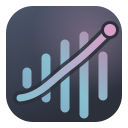
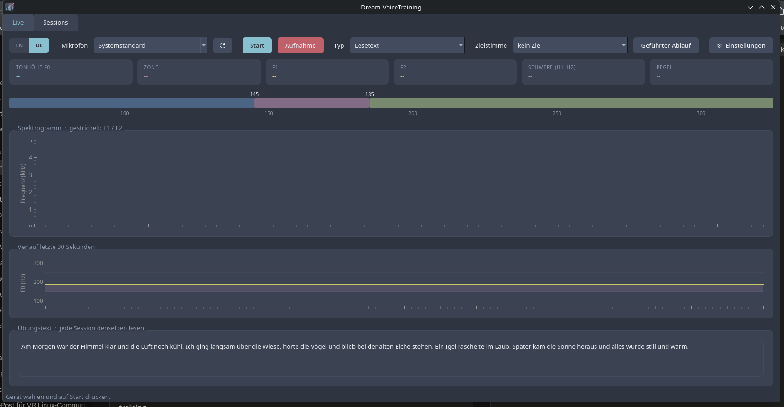
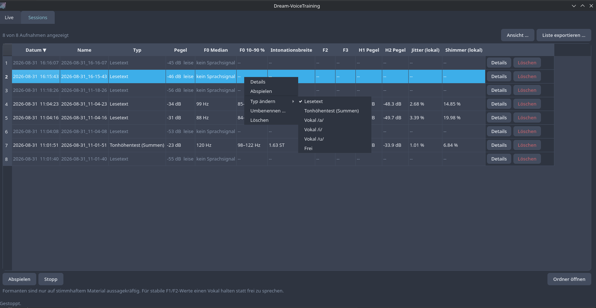
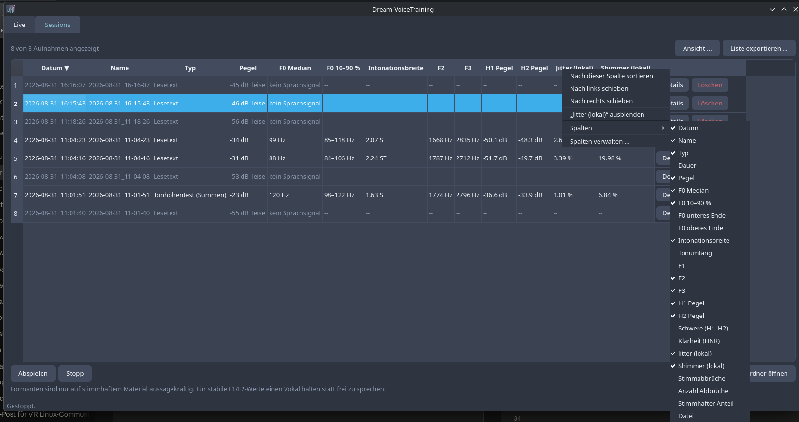
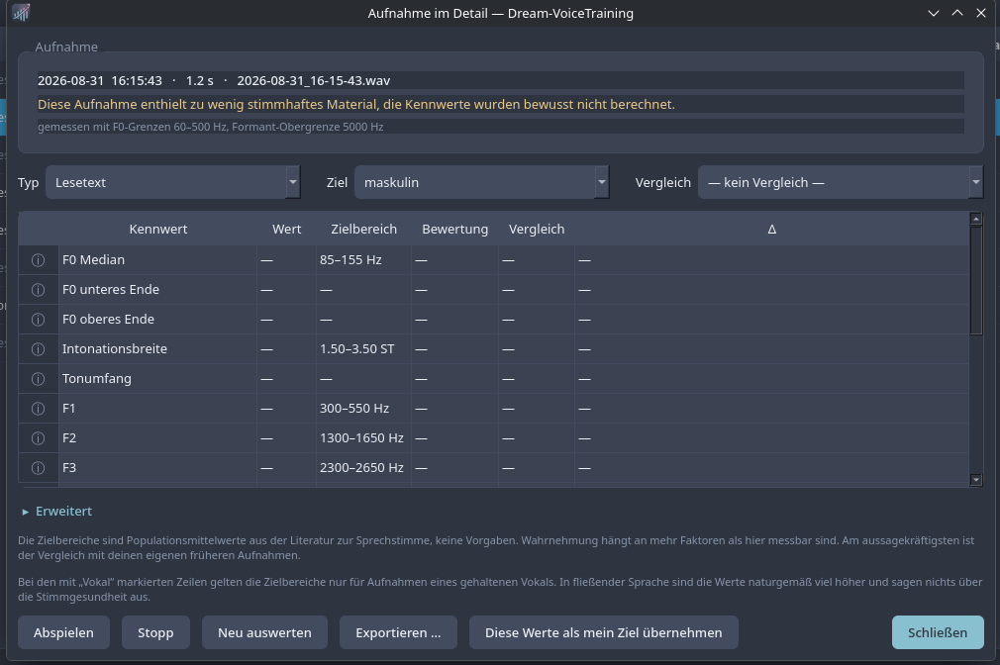
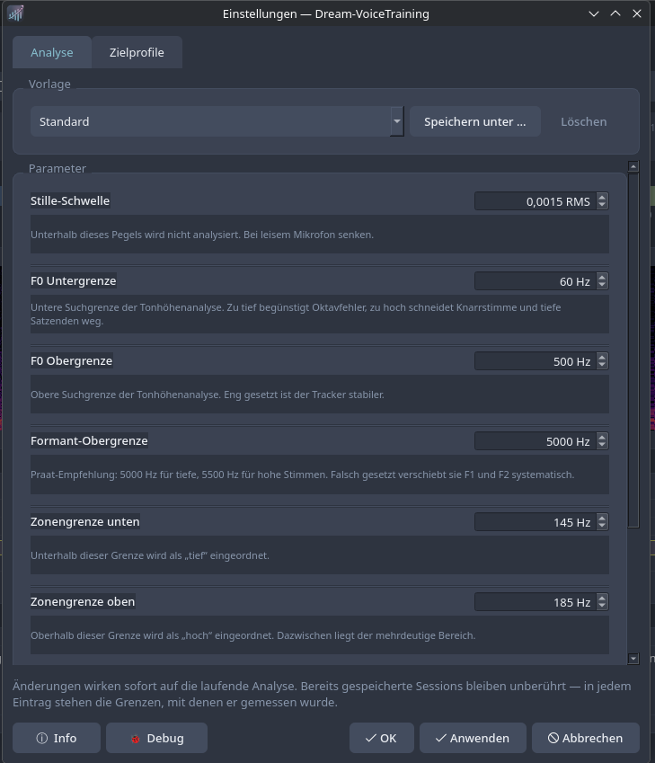
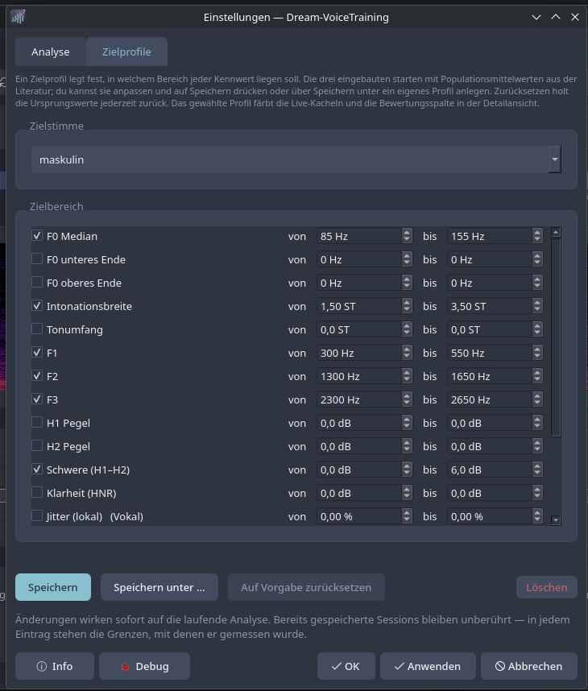

<div align="center">



# Dream-VoiceTraining

**Measure what your voice is actually doing, and watch it change over months.**

Pitch, resonance, weight and voice quality — live while you speak, and tracked
across sessions.

[](LICENSE)


[Deutsche Fassung](README.de.md)

</div>

---

## What it looks like

<table>
  <tr>
    <td><b>Live view</b><br></td>
    <td><b>Session list</b><br></td>
    <td><b>Column menu</b><br></td>
  </tr>
  <tr>
    <td><b>Recording in detail</b><br></td>
    <td><b>Settings · Analysis</b><br></td>
    <td><b>Settings · Target profiles</b><br></td>
  </tr>
</table>

**Live view** — everything in one bar: language, microphone, recording type,
target voice. Below it the readouts, the zone bar, the spectrogram with F1 and
F2 marked, the pitch history and the practice text.

**Session list** — right-click a row for details, playback, renaming, deletion
or changing the recording type afterwards. Recordings without a usable voice
are greyed out and say so instead of showing invented numbers. Right-clicking
a header offers sorting, moving, hiding and all 23 columns as a checkable list.

**Detail view** — eighteen metrics, each with an explanation behind the ⓘ,
checked against a target profile and optionally compared against another
recording. "Advanced" unfolds the waveform with a draggable region. The
example shows a recording that was too quiet: the metrics stay blank rather
than being guessed.

**Settings** — analysis parameters with templates on one tab, target profiles
on the other, where each of the eighteen metrics can be switched on and given
a range.

## Please read this first

This is a **measuring instrument, not a therapy programme.** It tells you what
your voice is doing. It does not tell you what to do about it, and it cannot
hear whether you sound good.

- **Never train through pain.** If your throat hurts, if your voice feels
  scratchy, or if you are hoarse after a session, stop. Those are signs of
  too much tension or pressure, not signs of effort paying off. Damage from
  pushing a voice takes far longer to undo than it takes to cause.
- **The numbers are not a score.** The reference ranges are population
  averages from the phonetics literature. Two people with identical
  measurements can be perceived completely differently, and perception
  depends on far more than anything measurable here. Use them for
  orientation and to compare yourself against your own earlier recordings.
- **This cannot diagnose anything.** Jitter, shimmer and harmonicity appear
  in clinical literature, but the values here come from ordinary speech on
  consumer microphones and mean nothing diagnostically. Persistent hoarseness
  belongs to an ENT doctor.
- **A speech-language pathologist beats any software.** A few sessions with
  someone who can actually hear you will save you hundreds of hours of
  guessing, because early on you cannot judge your own output reliably. In
  Germany, gender-affirming voice therapy is prescribable and covered by
  statutory health insurance.

Community resources worth knowing: the
[Voice Resource Project wiki](https://wiki.sumianvoice.com/),
[Spectrus](https://spec.sumianvoice.com/) for a quick browser spectrogram,
and r/transvoice.

---

## What it does

**Live view.** Pitch (F0), the first two formants, weight (H1–H2) and the
input level as large readouts. Pick a target voice and they turn green or
amber against it; leave it off and they stay neutral. A scrolling spectrogram with dashed markers where F1 and F2 sit, so
you can see resonance move while you speak. A pitch history over the last 30
seconds with your target zone shaded. A zone bar showing where you are between
your configured boundaries.

**Sessions.** Record, and every take is stored as a WAV plus a set of metrics.
The list shows date, duration, level, pitch and formants at a glance. Anything
that was too quiet or contained no usable voice is marked as such instead of
being given misleading numbers.

**Detail view.** Eighteen metrics per recording, each with an explanation
behind an ⓘ. Pick a target profile — masculine, androgynous or feminine — and
every metric is checked against the corresponding range. Pick any other
recording as a comparison and get a delta column. Export the whole thing as
readable text or as CSV.

**Advanced mode.** The waveform of the recording with a draggable region.
Select part of it, analyse just that, play just that. This is how you get
meaningful formant, jitter and shimmer numbers: record a long take with a
sustained vowel, then cut out the stable middle.

**Recording types.** Every take is filed as a reading text, a pitch test (a
held hum), /a/, /i/, /u/ or free. Picked before recording and sortable as a
column, so a held vowel is never averaged together with connected speech.

**First-run introduction.** On the very first start the program asks for a
language — picking one moves straight on — and then walks through nine short
pages: level and microphone, recording types, a recommended first round (pitch
test, then /a/, /i/ and /u/, each as its own take), where to look up what F0
and the formants are, the session list, advanced mode, making the column layout
yours, what sits behind the settings button, and one page on not training
through pain that ends with the project links — source, Discord, Ko-fi. Each page opens at the size it needs rather than one size for
all.

While a page is open, a **pulsing golden ⓘ** sits on the control that page is
about — the microphone list, the type box, the ⓘ in the toolbar, the Sessions
tab, the view button — so nobody has to hunt for it. Pages about the detail
view carry a screenshot, in the interface language, with the same marker on the
spot that matters; `packaging/make-intro-shots.py` regenerates those from the
real interface. The
introduction is not modal, so the microphone can be set up while reading, and
it is reachable again from *Settings → Info → Show introduction again*.

**Session list.** Click a column header to sort, click again to reverse.
Right-click a row for details, playback, rename or delete; right-click a
column header to sort, hide it or toggle any column straight from the menu.
Columns can be dragged into any order.
The view dialog picks which of the 23 available columns to show — including H1, H2, jitter,
shimmer and voice breaks — sets the sort order and optionally limits the list
to a date range. The list exports to text or CSV.

**Debug window.** Reachable from the settings dialog. Warnings and caught exceptions with tracebacks and
environment details, exportable as a text file for bug reports. Empty is the
normal state.

**Target profiles.** A dropdown in the Live toolbar picks the target voice —
masculine, androgynous, feminine or one of your own. It starts at *no target*
on purpose: a colour changing while you speak pulls your attention to the
screen, and attention on the screen is attention off your voice. The detail
view has its own selection, defaulting to feminine, so you can look at targets
afterwards without them nagging you during practice. The settings have a tab
for editing the range of any of the eighteen metrics — H1 and H2 separately
included — and saving it under your own name; the
built-in three start from population averages and can be adjusted, saved
under a new name, or reset back to the literature values.

**Themes.** Eight built-in colour schemes, every colour role recolourable
individually, and an optional background image with adjustable panel
transparency.

**Info tab.** Version, licence, links and where your files live, with a
button to replay the introduction, open the debug log or copy your system
information for a bug report.

**Reference window.** The ⓘ in the toolbar opens nineteen topics explaining
what every number means and what physically changes it — non-modal, so it
stays open beside the main window while you record.

**Settings.** Every analysis parameter is adjustable while the program runs,
with six built-in templates for different situations. Nothing requires a
restart.

---

## Metrics

| Metric | What it tells you |
|---|---|
| **F0 median** | Average speaking pitch. The most cited value and the least important one on its own. |
| **F0 10 % / 90 %** | How far down sentence endings drop and how far up you reach. |
| **Intonation width** | Standard deviation in semitones — how much melody your speech carries. |
| **Pitch range** | Distance between the two ends, in semitones. |
| **F1 / F2 / F3** | Formants. F2 is the single most useful number for resonance; F3 tracks vocal tract length closely. |
| **H1 / H2 / H1–H2** | Levels of the first two harmonics and their gap. A large gap means light, breathy production; a small one means heavy, pressed. |
| **Clarity (HNR)** | Harmonics-to-noise ratio. Low means breathy — or that the recording was too quiet. |
| **Jitter / shimmer / voice breaks** | Cycle-to-cycle stability. Reference ranges apply to **sustained vowels only**; connected speech is naturally far higher. |
| **Voiced share** | How much of the recording was recognised as voice at all. |
| **Recording level** | Peak level. Below −40 dBFS the measurements stop being trustworthy. |

Resonance matters more than pitch. Raising F0 without moving the formants
produces a voice that reads as low-pitched rather than differently gendered,
which is why F2, F3 and H1–H2 are given as much weight here as F0.

---

## Installing

### The short way — any distribution

```sh
curl -fsSL https://raw.githubusercontent.com/yakuda-stack/Dream-VoiceTraining/main/install.sh | bash
```

Detects Debian, Ubuntu, Fedora, Arch, CachyOS and openSUSE, installs the
system packages that have no Python equivalent (PortAudio, venv, git), fetches
the source into `~/.local/lib/dream-voicetraining`, builds its own Python
environment and adds a menu entry. `sudo` is used only for the system packages
and is announced before it happens; everything else stays under `~/.local`.

Piping a script into a shell means trusting it. If you would rather look first,
which is the sensible habit:

```sh
curl -fsSLO https://raw.githubusercontent.com/yakuda-stack/Dream-VoiceTraining/main/install.sh
less install.sh
bash install.sh
```

Removing it again keeps your recordings and settings:

```sh
bash install.sh --uninstall
```

Useful flags: `--no-deps` skips the system packages, `PREFIX=/somewhere` moves
the installation.

### Arch, CachyOS, EndeavourOS — from the AUR

```sh
paru -S dream-voicetraining         # or yay, or any other AUR helper
```

That is the whole thing. The helper pulls the dependencies from the AUR as
well, and updates arrive with your usual `paru -Syu`.

Expect a few minutes on the first install: `praat-parselmouth` compiles the
bundled Praat sources. If that build fails after a Python version bump in
Arch, install `python-praat-parselmouth-bin` first — it takes the official
wheel and needs no compiler:

```sh
paru -S python-praat-parselmouth-bin dream-voicetraining
```

<details>
<summary>Building the packages yourself from this repository</summary>

```sh
git clone https://github.com/yakuda-stack/Dream-VoiceTraining
cd Dream-VoiceTraining/packaging
makepkg -si -p PKGBUILD.python-praat-parselmouth
paru -Ui
```

`paru` rather than `makepkg` for the second step: `python-sounddevice` lives
in the AUR, and `makepkg` only knows pacman. With yay: `yay -Bi .`

</details>

### Windows

Two single files on the
[Releases](https://github.com/yakuda-stack/Dream-VoiceTraining/releases) page:

- **`Dream-VoiceTraining-<version>-setup.exe`** — a plain wizard, installs to
  `C:\Program Files\Dream-VoiceTraining`, asks once for administrator rights,
  and offers the desktop icon and start menu entry as tick boxes. Uninstalling
  works from Settings like any other program and leaves your recordings
  alone.
- Prefer the single executable? Take it and run it. On the first start it asks
  once whether it should move into its own folder and add a shortcut; say no
  and it keeps running from wherever it sits.
- **`Dream-VoiceTraining-Portable.exe`** — run it from anywhere. Settings and
  recordings land in a `Dream-VoiceTraining-Data` folder next to the
  executable, so a USB stick keeps everything together.

Neither needs an `_internal` folder or any other file beside it.

### AppImage

Download from
[Releases](https://github.com/yakuda-stack/Dream-VoiceTraining/releases):

```sh
chmod +x Dream-VoiceTraining-*.AppImage
./Dream-VoiceTraining-*.AppImage
```

One file for every system: the runtime uses FUSE 3, falls back to FUSE 2 and
extracts itself if neither is available. Nothing to install.

PortAudio has to be present on the host — it is not bundled, because audio
routing has to come from your system to work at all.

### Windows

Download the installer or the portable ZIP from
[Releases](https://github.com/yakuda-stack/Dream-VoiceTraining/releases).
The installer needs no administrator rights and leaves your recordings and
settings in place when uninstalling.

Nothing else to install — the PortAudio library ships inside the build.

Building it yourself needs Python 3.10+ from python.org (not the Store
version, which restricts access to `%LOCALAPPDATA%`):

```powershell
powershell -ExecutionPolicy Bypass -File packaging\windows\build_windows.ps1
```

Produces two single files in `dist\`, each carrying its own Python:

- `Dream-VoiceTraining-<version>-setup.exe` — needs
  [Inno Setup](https://jrsoftware.org/isdl.php); without it the script says so
  and builds the portable one only
- `Dream-VoiceTraining-<version>-Portable.exe` — double-click, nothing beside
  it, settings and recordings land in a `Dream-VoiceTraining-Data` folder next
  to the file

To run from source instead, so that editing a `.py` file takes effect on the
next start:

```powershell
powershell -ExecutionPolicy Bypass -File packaging\windows\install_windows.ps1
```

That one checks for Python 3.10+, installs it through winget if it is missing,
builds its own environment under `%LOCALAPPDATA%\Programs\Dream-VoiceTraining`,
and creates a desktop icon and a start menu entry, so pressing the Windows key
and typing *dream* or *voice* finds it. It also registers under *Apps &
features*, so uninstalling works from Settings like any other program (or run
the `uninstall.ps1` it leaves behind). Recordings and settings are never
touched by an uninstall.

Your files live in `%APPDATA%\Dream-VoiceTraining` (settings) and
`%LOCALAPPDATA%\Dream-VoiceTraining` (recordings).

### From source, for development

```sh
python -m venv .venv
source .venv/bin/activate            # fish: source .venv/bin/activate.fish
pip install -r requirements-dev.txt
python main.py
```

**PortAudio is required** and is not a Python package:

```sh
sudo pacman -S portaudio                        # Arch, CachyOS
sudo apt install libportaudio2 libpulse0        # Debian, Ubuntu, Mint
sudo dnf install portaudio pulseaudio-utils     # Fedora
sudo zypper install portaudio pulseaudio-utils  # openSUSE
```

`pactl` (from `libpulse`) is optional but strongly recommended. Without it,
device names fall back to raw ALSA strings like
`USB Audio Device: USB Audio (hw:1,0)` instead of the readable PipeWire
descriptions.

A virtual environment does not survive its parent folder being renamed or
moved — the activation script writes absolute paths. If you move the project,
delete `.venv` and create it again.

---

## Getting your first measurement right

**Fix the level before anything else.** Open `pavucontrol`, go to the
recording tab and raise the input gain until the level card sits around −20 dB
while you speak normally. Sit roughly a hand's width from the microphone,
slightly off to the side so plosives do not hit it directly. If the level card
turns red, the signal is below the silence threshold and nothing is being
analysed.

Read the practice text once, all of it, and record it. That is your baseline.
Note the numbers. Then record `/a/`, `/i/` and `/u/` held for three seconds
each, and use advanced mode to cut out the stable middle of each — those give
you formant values that will still be comparable in two months.

From then on, ten to fifteen minutes a day beats two hours on a weekend. Use
the same text, the same microphone position and the same template every time,
otherwise you are measuring your setup rather than your voice.

Do not read anything into differences between two takes recorded minutes
apart. Day-to-day variation, microphone distance and how warmed up you are
move these numbers more than weeks of practice do. Trends need weeks.

---

## Where your data lives

Follows the XDG Base Directory Specification:

```
~/.config/dream-voicetraining/config.json          settings, templates
~/.local/share/dream-voicetraining/sessions/       recordings and metrics
```

`DREAM_VOICETRAINING_HOME` overrides both with a single directory, which is
useful for testing and for portable setups. Data from earlier versions is
picked up automatically on first start; existing files are never overwritten.

Everything is plain WAV and JSON. Nothing is uploaded anywhere, there is no
telemetry, and the program makes no network connections at all.

---

## When something is wrong

`diag.py` records three seconds through exactly the same path the program uses
and prints what arrives at the analysis stage:

```sh
python diag.py --list
python diag.py --device 0
```

Check "share exactly 0", "distinct values" and the example spectrum column at
the end. That output turned a two-hour guessing session into a five-minute fix
twice during development.

Common cases: a red level card means the input gain is too low or you picked a
monitor source instead of a microphone. "No speech signal" on a recording where
you definitely spoke means the level was too low for the voicing threshold —
fix the gain rather than lowering the threshold.

---

## Changelog

Every release is documented in [CHANGELOG.md](CHANGELOG.md), including what
was broken and why.

The step-by-step release workflow — GitHub, AppImage, AUR — is in
[update_DreamVoiceTraining.txt](update_DreamVoiceTraining.txt).

## Development

```sh
pip install -r requirements-dev.txt
python -m pytest tests/ -q
```

One hundred and sixteen tests covering the analysis core, settings persistence, path
resolution and migration, device enumeration and translation completeness.
Two of them are regression tests for real bugs: noise being reported as a
voice, and the spectrogram collapsing to one colour.

Adding a translated string means adding it to `i18n.py` and using `t("key")`.
The test suite fails if a key is used but not defined, if a string is missing
either language, or if placeholders differ between the two.

Contributions welcome, especially from people who actually train their voice
and can say which numbers turned out to be useful and which are noise.

---

## Community

- **Discord** — https://discord.gg/UkhJSz3Ctf
- **Ko-fi** — https://ko-fi.com/yakuda_ (entirely optional; the program is
  free software and stays that way)

Bug reports go to the issue tracker. The settings dialog has an About window
with a button that copies your system information, and a debug window whose
log can be exported — attaching both makes a report far easier to act on.

## Licence

GPL-3.0-or-later. Not a free choice: this links Praat through Parselmouth, and
Praat is GPL-3.0. See [THIRD_PARTY_NOTICES.md](THIRD_PARTY_NOTICES.md) for the
full dependency list and the note on the LGPL components.

If you publish measurements made with this, cite Praat and Parselmouth rather
than this tool.

## Note on how this was built

## Note on how this was built

* **Idea, Architecture & System Design:** Concept, functionality, UX/UI, and overall system architecture were fully conceived and designed by me.
* **Code Implementation:** Written, generated, and refactored using Claude Code (Anthropic).
* **Documentation & Texts:** Drafted and formatted with assistance from Google Gemini.

Every line of code and every generated text has been reviewed, executed, and tested by me before release. AI was used as a tool to realize this project, but final responsibility for code quality, review, testing, and maintenance lies entirely with me.

What that does not change: every line here has been read, run and tested by
me before it shipped. Review, testing and maintenance are mine, and so is
responsibility for anything that goes wrong. Every bug fixed in this repository was found by
measuring, not by guessing, and the diagnostic script and the test suite exist
so that stays true.
